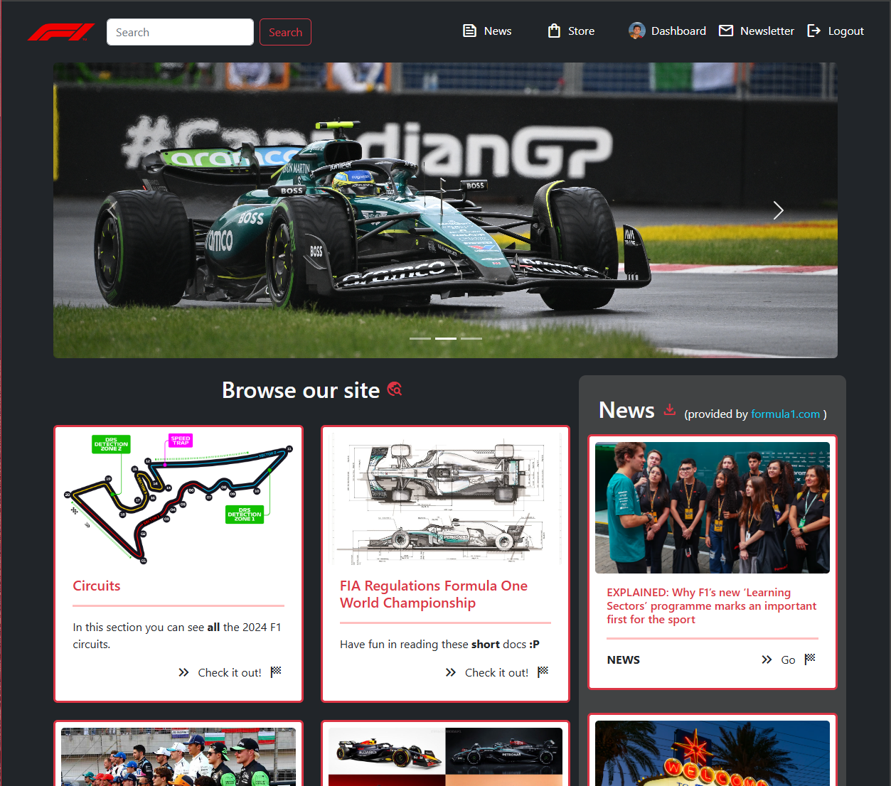
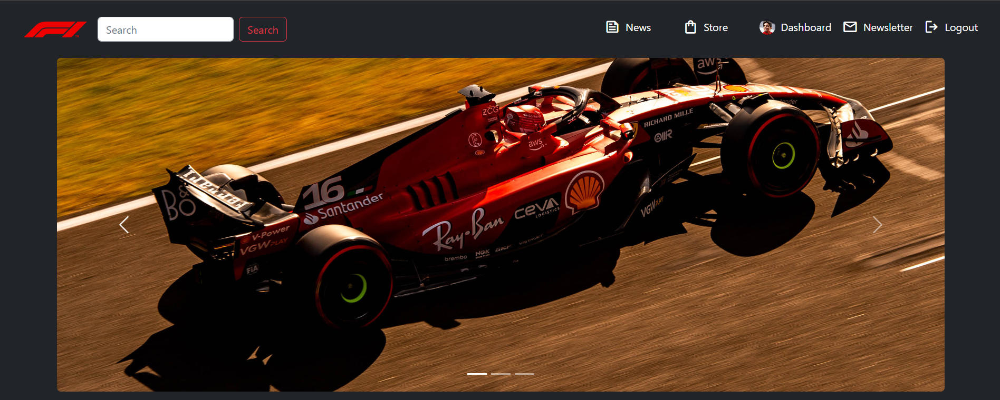
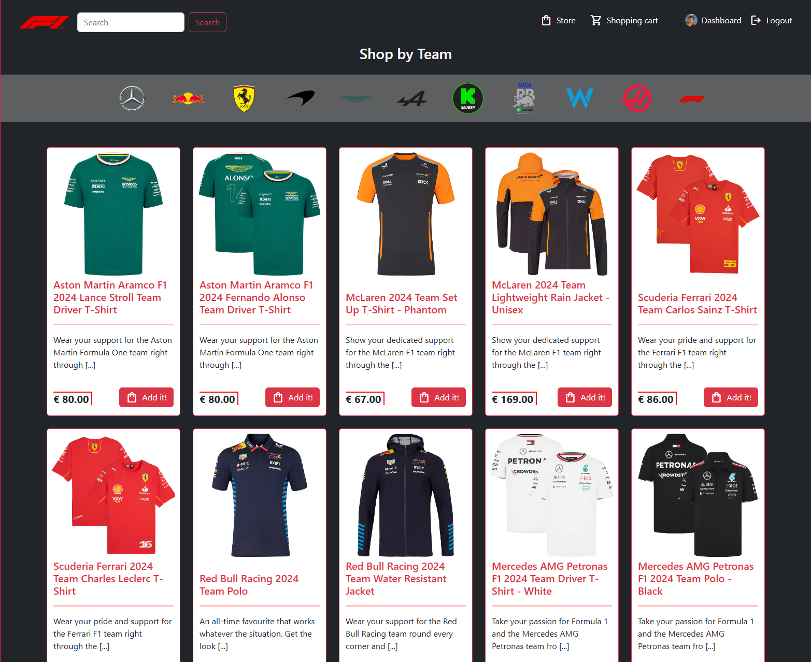
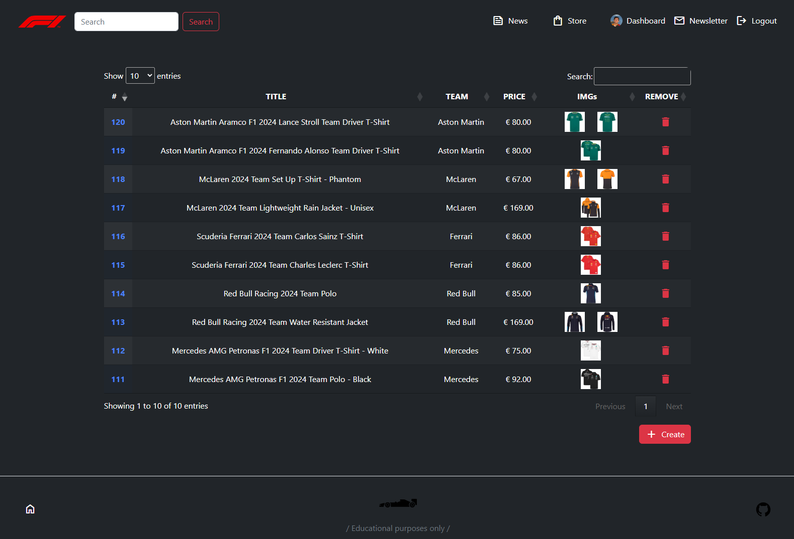

# 🛜 F1-WEBAPP
**NB**: **PERSONAL** purposes only

### What you can do
🛍️ Virtually buy products in the **STORE**  
📰 Keep yourself updated with the most recent **NEWS**  
🧑‍💼 If you are an **ADMIN**, you can manage the store and users data, and email the users who subscribed to the newsletter  

The news, teams and drivers lists are fetched through **web-scraping**

### HOW
🧑‍💻 Back-end ➡️ PHP (and PHPMailer) / AWS-S3 / MySQL
 
🧑‍💻 Front-end ➡️ JS / CSS / Bootstrap / HTML

### USAGE
*keys.ini* file with setup keys inside is required to work properly with the DB (MySQL) and the [AWS-S3](https://aws.amazon.com/it/s3/) storage

### `git clone --recurse-submodules https://github.com/matteonaccarato/f1-webapp.git`
Clones repository and PHPMailer submodule

### `git pull --recurse-submodules`
Updates submodules

### `composer install`
Install useful dependencies

### SOURCES
☀️ [**OpenWeatherMap**](https://openweathermap.org/api)  
🏎️ [**Formula 1**](https://www.formula1.com/)  

#### Home

#### Circuits

#### Store

#### Admin dashboard

