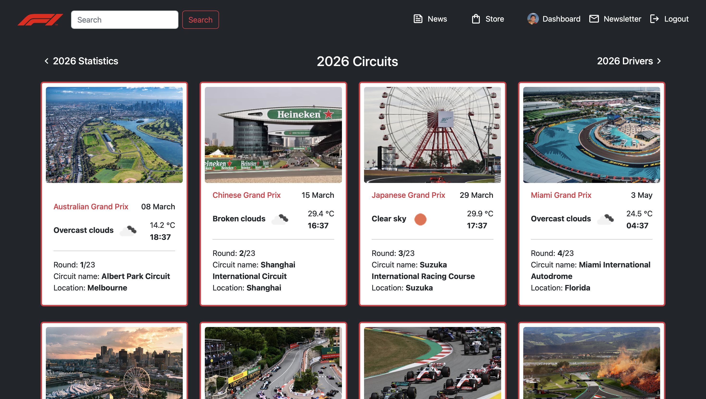
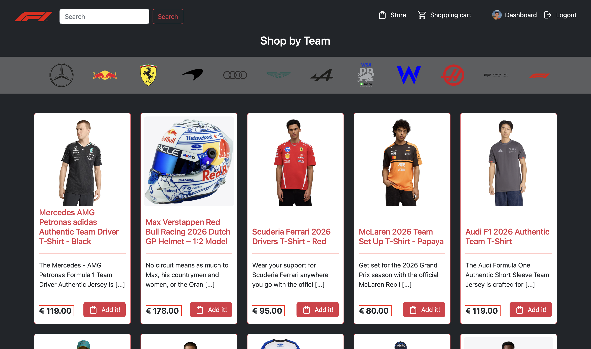
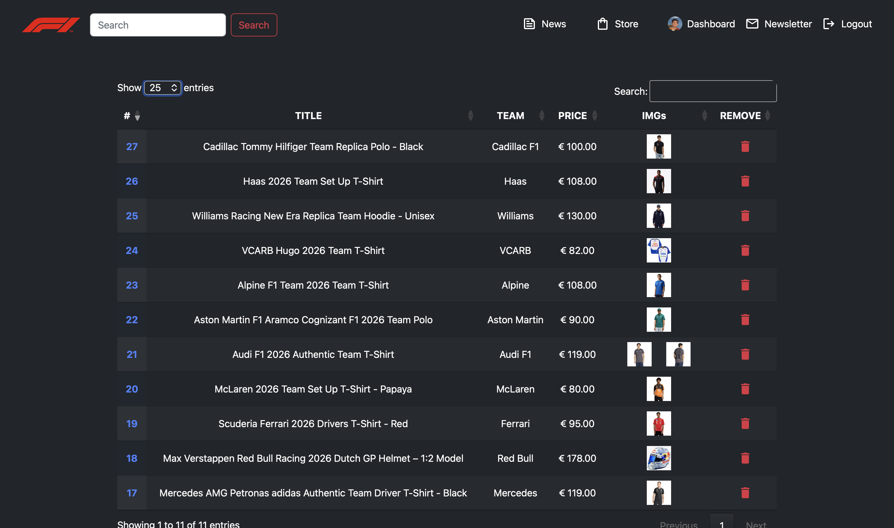

# 🛜 F1-WEBAPP
**NB**: **PERSONAL** purposes only

### What you can do
🛍️ Virtually buy products in the **STORE** <br>
📰 Keep yourself updated with the most recent **NEWS** <br>
🧑‍💼 If you are an **ADMIN**, you can manage the store and users data, and email the users who subscribed to the newsletter <br>

The news, teams and drivers lists are fetched through **web-scraping**
<hr>

### HOW
🧑‍💻 Back-end ➡️ PHP (and PHPMailer) / AWS-S3 / MySQL
<br>
🧑‍💻 Front-end ➡️ JS / CSS / Bootstrap / HTML

<hr>

### USAGE
*keys.ini* file with setup keys inside is required to work properly with the DB (MySQL) and the [AWS-S3](https://aws.amazon.com/it/s3/) storage

### `git clone --recurse-submodules https://github.com/matteonaccarato/f1-webapp.git`
Clones repository and PHPMailer submodule

### `git pull --recurse-submodules`
Updates submodules

### `composer install`
Install useful dependencies

### Testing and local DB with Docker

1. Copy `.env.example` to `.env` if you want to override the default local connection values.
2. Start the MySQL service:
   `docker compose up -d mysql`
3. Run tests:
   `vendor/bin/phpunit --configuration phpunit.xml`

The Docker Compose setup loads the database schema from `docker/mysql/init/schema.sql`, so the project can be validated with a disposable MySQL instance.

### Reuse this pipeline from `formula1-info`

The workflow `.github/workflows/phpunit.yml` supports `workflow_call`, so a parent repository can execute the same tests.

Example caller workflow in `formula1-info`:

```yaml
name: f1-webapp tests

on:
  push:
  pull_request:

jobs:
  f1-webapp-phpunit:
    uses: matteonaccarato/f1-webapp/.github/workflows/phpunit.yml@main
    with:
      project_path: f1-webapp
      php_version: "8.2"
```

### SOURCES
☀️ [**OpenWeatherMap**](https://openweathermap.org/api) <br>
🏎️ [**Formula 1**](https://www.formula1.com/) <br>

<hr>

#### Home


<hr>

#### Circuits

<hr>

#### Store

<hr>

#### Admin dashboard

